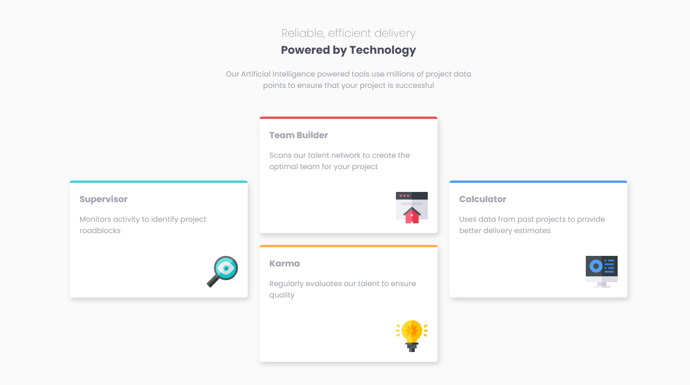

# Frontend Mentor - Four card feature section solution

This is a solution to the [Four card feature section challenge on Frontend Mentor](https://www.frontendmentor.io/challenges/four-card-feature-section-weK1eFYK). Frontend Mentor challenges help you improve your coding skills by building realistic projects.

## Table of contents

  - [The challenge](#the-challenge)
  - [Screenshot](#screenshot)
  - [Links](#links)
  - [Built with](#built-with)
  - [What I learned](#what-i-learned)
  - [Continued development](#continued-development)
  - [Useful resources](#useful-resources)
- [Author](#author)

### The challenge

Users should be able to:

- View the optimal layout for the site depending on their device's screen size

### Screenshot

### Links

- Solution URL: [https://github.com/monicaivanov/Four-card-master.git]
- Live Site URL: [https://monicaivanov.github.io/Four-card-master/]

### Built with

- Semantic HTML5 markup
- CSS custom properties
- Flexbox
- CSS Grid
- Mobile-first workflow

### What I learned
I learned to use grid and get more practice with mobile first design.

### Continued development

Get better at using flexbox and grid.

### Useful resources

- Kevin Powel youtube channel and courses on flexbox and grid

## Author
- Frontend Mentor - [@monicaivanov](https://www.frontendmentor.io/profile/monicaivanov)

